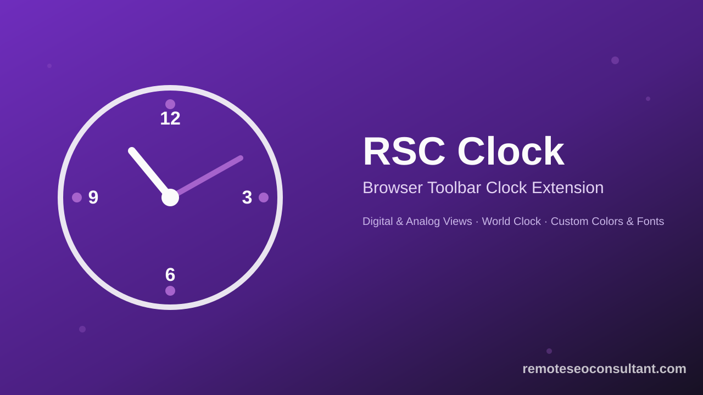
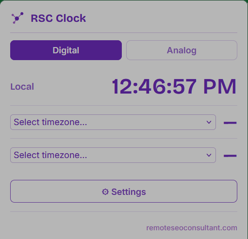
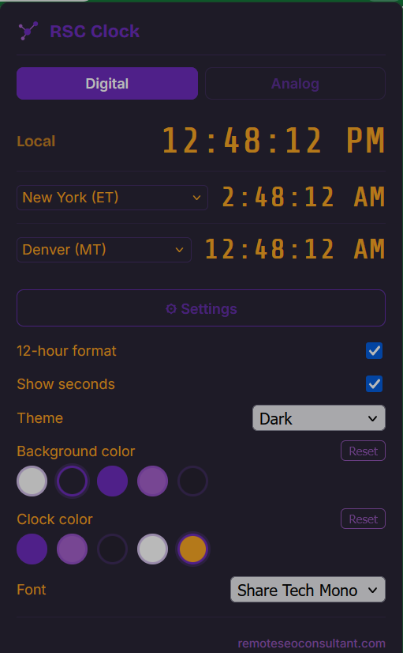
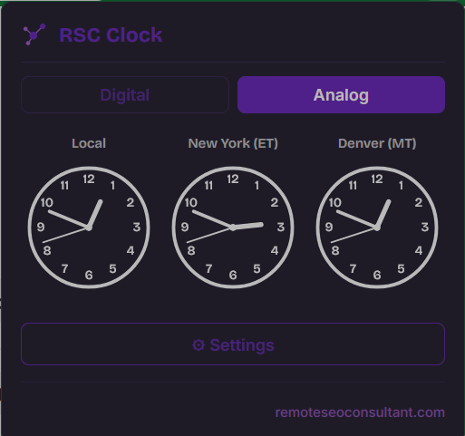
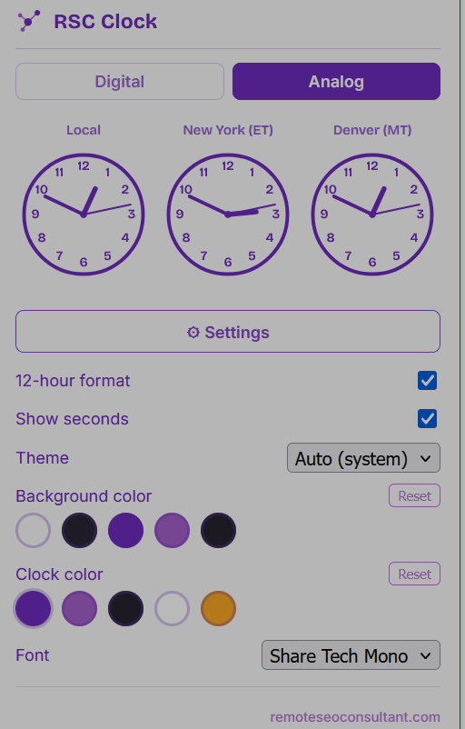

# RSC Clock — Browser Toolbar Clock Extension



A lightweight **browser toolbar clock extension** for Chrome and Firefox. Click the toolbar icon to see the time — locally and across up to two other timezones — in either a digital or fully-numbered analog view, styled the way you want.

## Features

- **Digital & Analog views** — switch between a digital readout and an analog clock face with all 12 numbers shown (no dots, no minimalist markers)
- **World clock** — add two extra timezone slots alongside your local time
- **12 / 24-hour format** toggle, with AM/PM
- **Seconds on/off** toggle
- **Light / Dark / Auto** theme, following your system preference
- **Custom colors** — quick-pick swatches for background and clock color
- **Custom fonts** for the clock display (Roboto Mono, Orbitron, Share Tech Mono, or system default)
- Settings sync via the browser's built-in `storage.sync` — no account, no external server, no tracking

## Screenshots

<table>
  <tr>
    <td align="center">
      <br/>
      <sub>Digital view — local time + world clock</sub>
    </td>
    <td align="center">
      <br/>
      <sub>Dark theme, custom colors &amp; font</sub>
    </td>
  </tr>
  <tr>
    <td align="center">
      <br/>
      <sub>Analog view — fully numbered clock faces</sub>
    </td>
    <td align="center">
      <br/>
      <sub>Analog view with settings panel open</sub>
    </td>
  </tr>
</table>

## Install

### Chrome / Edge / Brave (Chromium)
1. Go to `chrome://extensions`
2. Enable **Developer mode**
3. Click **Load unpacked** and select the [`chrome-extensions/rsc-clock`](chrome-extensions/rsc-clock) folder

### Firefox
1. Go to `about:debugging#/runtime/this-firefox`
2. Click **Load Temporary Add-on…**
3. Select `manifest.json` inside [`firefox-addons/rsc-clock`](firefox-addons/rsc-clock)

## Releasing a new Firefox version

New versions publish to addons.mozilla.org automatically via GitHub Actions ([`.github/workflows/publish-firefox.yml`](.github/workflows/publish-firefox.yml)).

**One-time setup** (already done for this repo, noted here for reference):
1. Get an API key/secret from [addons.mozilla.org/developers/addon/api/key](https://addons.mozilla.org/developers/addon/api/key/)
2. Add them as repo secrets under **Settings → Secrets and variables → Actions**:
   - `AMO_JWT_ISSUER`
   - `AMO_JWT_SECRET`

**To publish a new version:**
1. Bump `"version"` in [`firefox-addons/rsc-clock/manifest.json`](firefox-addons/rsc-clock/manifest.json)
2. Commit, then tag and push:
   ```bash
   git add .
   git commit -m "Bump version to 1.1.0"
   git tag v1.1.0
   git push origin main --tags
   ```
3. The workflow lints the extension, verifies the tag matches the manifest version, and submits it to AMO's listed channel automatically

## Why this extension

Most toolbar clock extensions are either bare-bones (no world clock, no styling) or bloated with permissions and trackers. RSC Clock asks for only the `storage` permission, runs entirely client-side, and focuses on doing one thing well: showing the time, exactly how you like it.

## License

All rights reserved — see [LICENSE](LICENSE). Source is public for review and reference, not for reuse or redistribution.

## Author

Built by **[Md. Istiqur Rahman](https://remoteseoconsultant.com)** — Remote SEO Consultant for SaaS & eCommerce, and Remote GTM Manager for Solopreneurs & Entrepreneurs.
